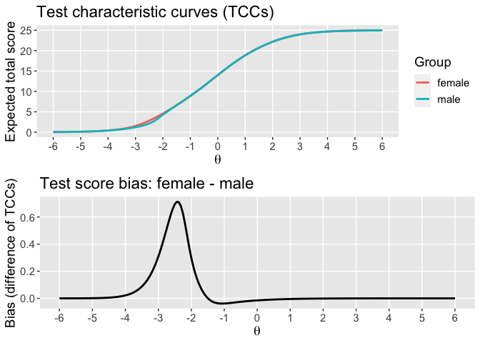

Summary of updates on “check” branch
================
PFH
Feb 5, 2020

# Summary

New versions of the following files were created. A main theme of the
changes was pulling stuff out of `effect_robustness` and writing stand
alone functions for that stuff.

  - newData-Prep.R: the function `dif_data_prep` now replaces
    `dif_prep`. It contains some stuff previously in `dif_analysis`:
    no.var.items, no.var.by.group.items, and poly.items.

  - newDIF-Analysis.R: Now includes `dif_models` which runs the
    `dif.mod` and, if necessary, the `no.dif.mod` previously in
    `effect_robustness`.

  - Hedges2007.R: replaces Est-Smd.R with an effect size function that
    has less input options.

  - new\_Robusntess-Functions.R includes a stripped down version of
    `effect_robustness` that is basically just a wrapper for
    `hedges2007` as well as a bunch of helper functions that work on the
    output of `effect_robustness`.

  - newPlot-Functions.R Minor updates to existing plots and added
    `effects_plot` previously in `effect_robustness`.

A second theme was to chain the functions so that, once the user
specifices the data, the rest is on rails. If the user wants to run a
conditional or an unconditional analysis, that is all specified in terms
of the new `dif_data_prep` function. Once the data is prepped, that is
the only input required by the user to produce a report. There are other
ways to use the functions too but that was the target use case.

A lot of variables were renamed along the way. I know this is a pain in
the but I think it helps address the issues we talked about before
(e.g., using “scale” in multiple different ways).

  - item.data replaces measure.data and data and similar variants
  - dif.group.id replaces dif.group
  - tx.group.id replaces tx.group
  - cluster.id replaces clusters
  - na.to.0 replaces na0
  - match.type replaces score.type
  - I am probably missing some

Note that I didn’t do any renaming in functions that I did not edit,
notably the low-level dif functions (e.g. loess). So changes of
var.names is no universal yet. The probably don’t need to be either.

In summary, I did a lot of re-arranging in the “middle layer” of the
project. What is left to do is plug the new output illustrated below
into `dif_report`. I tried to make sure that the new outputs are
comparably formatted to what was coming out of `effect_robusness`. The
main difference is that the new outputs are formatted as list. Anyway, I
hope it isn’t too much of pain to patch up the report again…let me know
if it is.

# Example

Data prep is now via `dif_data_prep`.

``` r
library(WBdif)
load("Bangladesh_Recoded.RData")
midline <- bang.recode[bang.recode$line == "Mid",]

i <- 1
midline <- bang.recode[bang.recode$line == "Mid",]
i <- 1

# data prep is now via dif_data_prep
dif.data <- dif_data_prep(item.data = midline[domain.items[[i]]],
                         tx.group.id = midline$tx,
                         dif.group.id = midline$gender,
                         cluster.id = NULL,
                         na.to.0 = F)
```

`dif_analysis` now takes `dif.data` as input rather than components
thereof.

``` r
dif.analysis <- dif_analysis(dif.data = dif.data,
                             methods = c("loess", "IRT"))
```

    ## Warning: Log-likelihood was decreasing near the ML solution. EM method may be
    ## unstable
    
    ## Warning: Log-likelihood was decreasing near the ML solution. EM method may be
    ## unstable

``` r
names(dif.analysis)
```

    ## [1] "loess"    "MH"       "logistic" "IRT"      "inputs"

If no biased items are detected by `dif.analysis`, we should skip every
thing that follows and just produce the report that says there was no
DIF (I realize this is a change from before).

If there are biased items, `dif_models` runs the `dif.mod` identified by
`dif.analysis`. This previously happened in `effect_robustness`. It also
runs the `no.dif.mod` if needed, or just plucks it out of
`dif.analysis`.

The argument `biased.items` can be one of `c("IRT, "MH", "logistic")` or
a numeric vector indicating which columns from `item.data` to treat as
biased.

All subsequent functions require `dif.analysis`, so, if it needs to be
forced to run even when there was no `dif.analysis` reported no DIF
(e.g., for debugging), manually enter a numeric vector for
`biased.items`.

``` r
dif.models <- dif_models(dif.analysis, biased.items = c(1,2,3))
```

    ## Warning in if (biased.items != 0) {: the condition has length > 1 and only the
    ## first element will be used

    ## Warning: Log-likelihood was decreasing near the ML solution. EM method may be
    ## unstable

``` r
names(dif.models)
```

    ## [1] "no.dif.mod"   "dif.mod"      "biased.items" "inputs"

I spend a lot of time arriving back at the same plots we had in the
first place…sigh

``` r
bias.plots <- bias_plots(dif.models)
gridExtra::grid.arrange(bias.plots[[1]], bias.plots[[2]])
```

<!-- -->

The funciton `effect_robustness` is now just a wrapper for `hedges2007`,
which replaces `est_smd` and `smd_wrapper`. The output is a `list` whose
components are each like the `effects.data` object that was internal to
`effects_robustness`. Functions for computing effect plots, tables, and
coeff alpha are now external to `effect_robustness`. But, it still takes
a while to run due to calling `mirt::fscores` …

``` r
effects.list <- effect_robustness(dif.models)
names(effects.list)
```

    ## [1] "treatment - control: female" "treatment - control: male"  
    ## [3] "interaction"

The effect size plots previously in `effect_robustness` are now called
via `effects_plot` in the `newPlot-Functions.R` file

``` r
(effects.plots <- lapply(effects.list, effects_plot))
```

    ## $`treatment - control: female`

<!-- -->

    ## 
    ## $`treatment - control: male`

<!-- -->

    ## 
    ## $interaction

<!-- -->

The effect tables previously in `effect_robustness` is called via
`effects_table`. The format is somewhat different, as I dropped the
reliability adjusted effect sizes for the total scores and included the
standard errors from `hedges2007`.

``` r
effects.tables <- lapply(effects.list, effects_table)
lapply(effects.tables, knitr::kable)
```

    ## $`treatment - control: female`
    ## 
    ## 
    ## |Items        | IRT effect size|    IRT SE| Total score effect size| Total score SE|
    ## |:------------|---------------:|---------:|-----------------------:|--------------:|
    ## |All Items    |       0.5871881| 0.0697825|               0.5938925|      0.0698098|
    ## |Bias Omitted |       0.5812318| 0.0697583|               0.6184050|      0.0699093|
    ## 
    ## $`treatment - control: male`
    ## 
    ## 
    ## |Items        | IRT effect size|    IRT SE| Total score effect size| Total score SE|
    ## |:------------|---------------:|---------:|-----------------------:|--------------:|
    ## |All Items    |       0.4636102| 0.0677575|               0.4788108|      0.0678178|
    ## |Bias Omitted |       0.4816291| 0.0678290|               0.5116159|      0.0679477|
    ## 
    ## $interaction
    ## 
    ## 
    ## |Items        | IRT effect size|    IRT SE| Total score effect size| Total score SE|
    ## |:------------|---------------:|---------:|-----------------------:|--------------:|
    ## |All Items    |      -0.1235779| 0.0972660|              -0.1150817|      0.0973276|
    ## |Bias Omitted |      -0.0996027| 0.0972985|              -0.1067892|      0.0974895|

Coefficient alpha is also now external to `effect_robustness`. This is
just a wrapped on `est_alpha`.

``` r
alphas.list <- coeff_alpha(dif.models)
lapply(alphas.list, knitr::kable)
```

    ## Warning in kable_pipe(x = structure(character(0), .Dim = c(0L, 0L), .Dimnames =
    ## list(: The table should have a header (column names)

    ## $`treatment - control: female`
    ## 
    ## 
    ## |         x|
    ## |---------:|
    ## | 0.6122961|
    ## | 0.6037956|
    ## 
    ## $`treatment - control: male`
    ## 
    ## 
    ## |         x|
    ## |---------:|
    ## | 0.5851677|
    ## | 0.5695232|
    ## 
    ## $interaction
    ## 
    ## 
    ## ||
    ## ||
    ## ||
    ## ||

The function `effects_table` has an optional argument to include the
alphas.

``` r
effects.tables.with.alpha <- mapply(effects_table, effects.list, alphas.list)
lapply(effects.tables.with.alpha, knitr::kable)
```

    ## $`treatment - control: female`
    ## 
    ## 
    ## |Items        | IRT effect size|    IRT SE| Total score effect size| Total score SE| Total score alpha|
    ## |:------------|---------------:|---------:|-----------------------:|--------------:|-----------------:|
    ## |All Items    |       0.5871881| 0.0697825|               0.5938925|      0.0698098|         0.6122961|
    ## |Bias Omitted |       0.5812318| 0.0697583|               0.6184050|      0.0699093|         0.6037956|
    ## 
    ## $`treatment - control: male`
    ## 
    ## 
    ## |Items        | IRT effect size|    IRT SE| Total score effect size| Total score SE| Total score alpha|
    ## |:------------|---------------:|---------:|-----------------------:|--------------:|-----------------:|
    ## |All Items    |       0.4636102| 0.0677575|               0.4788108|      0.0678178|         0.5851677|
    ## |Bias Omitted |       0.4816291| 0.0678290|               0.5116159|      0.0679477|         0.5695232|
    ## 
    ## $interaction
    ## 
    ## 
    ## |Items        | IRT effect size|    IRT SE| Total score effect size| Total score SE|
    ## |:------------|---------------:|---------:|-----------------------:|--------------:|
    ## |All Items    |      -0.1235779| 0.0972660|              -0.1150817|      0.0973276|
    ## |Bias Omitted |      -0.0996027| 0.0972985|              -0.1067892|      0.0974895|

As I mentioned above, I didnt try to sort out how to put this into the
report. I am hoping the individual pieces shown above will be easy to
work with but let me know if not. I will work on updating documentation
over the next few days.
=======

# WBdif

**WBdif** contains functions to detect differential item functioning
(DIF), estimate treatment effects, evaluate the robustness of treatment
effects in the presence of DIF, and produce reports summarizing the
results. Development of **WBdif** was motivated by questions regarding
the psychometric properties of the early childhood development
assessments used by World Bank to evaluate intervention impacts.

The 3 main functions in \*\*WBdif\* are [`dif_analysis()`](#analysis),
[`robustness()`](#robustness), and [`dif_report()`](#report).

## Installation

``` r
install.packages("remotes")
remotes::install_github("knickodem/WBdif")
```

## Features

### Differential Item Functioning Analysis

### Treatment Effect Robustness

### Reporting

## Support and Suggestions

If you encounter any issues or have a suggestion for additional
features, please file a [Github
issue](https://github.com/knickodem/WBdif/issues) or contact us via
email.

