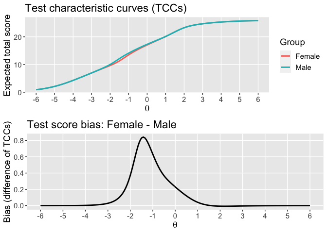
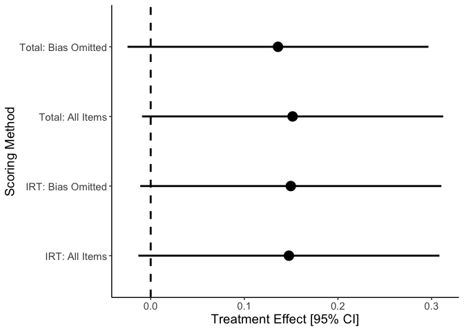
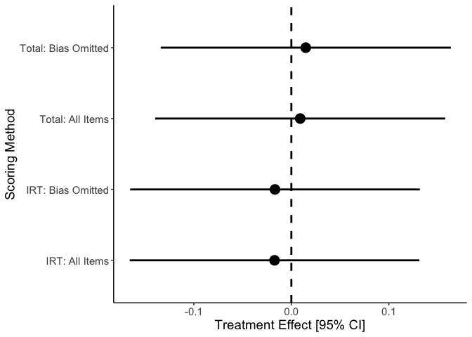
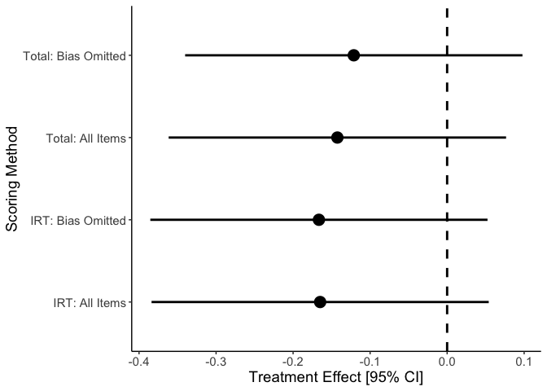

# WBdif

## Summary

Development of **WBdif** was motivated by questions regarding the
psychometric properties of early childhood development assessments used
as outcome measures in impact evaluations. This package provides methods
for (a) evaluating differential item functioning (DIF), (b) checking
whether DIF leads to biased treatment effects on the unit-weighted total
score or IRT-based scoring methods, and (c) providing DIF-corrected
treatment effects by either removing biased items (for the unit-weighted
total score) or using an IRT models that adjusts for the item bias (for
IRT-based scoring). The methods are documented in the report:
(forthcoming).

The methods for evaluating DIF include semi-parametric regression
(LOESS), the Mantel-Haenszel test, logistic regression, and multi-group
item response theory (IRT).

DIF can be evaluated with respect to the treatment variable, or with
respect to pre-treatment variables used to examine treatment
heterogeneity (e.g., gender, age, and socio-economic status). The
**WBdif** documentation refer to these as unconditional and conditional
treatment effects, respectively.

If assessment items have DIF with respect to treatment, the
unconditional treatment effect *may* be biased. The intuitive
interpretation here is that the treatment effect varies over the
assessment items, so reporting the treatment effect on an aggregate
score (e.g., the unit-weighted total score) may not reflect “true”
effect on the construct of interest.

If the assessment items have DIF with respect to a conditioning variable
(e.g., gender), the corresponding conditional treatment effects (e.g.,
the effect just for males, just for females, or their difference) *may*
be biased. In other words, randomization of treatment does not protect
conditional treatment effects from DIF with respect to the conditioning
variable.

**WBdif** provides two general workflows, both of which are illustrated
below. In the “basic” workflow, the user preps the data and then calls
an omnibus function (`summary_report`) that automates the DIF analysis
and, if there is any DIF detected, computes the treatment effects with
and without adjusting for DIF. The results are summarized in an .HTML
formatted report.

In the “advanced” workflow, the steps automated by `summary_report` can
be implemented directly by the user, which gives more control over which
DIF analyses are conducted and which items are identified as biased. The
advanced workflow is currently under construction, as the output
returned by most functions is not very user-friendly. In the future,
these outputs may be converted to S3 or S4 objects with methods (e.g.,
print, summary) that make them more user-friendly.

**WBdif** is in the alpha stage of development. Please report any bugs
or suggestions by opening a [Github
issue](https://github.com/knickodem/WBdif/issues).

## Installation

``` r
install.packages("remotes")
remotes::install_github("knickodem/WBdif")
library(WBdif)
```

## Basic workflow

The basic workflow requires only two functions:

  - `dif_data_prep()` is a pre-processing step that organizes input
    information for use in other **WBdif** functions and conducts some
    checks on the data. How the data is prepared effects the type of
    report that will be produced. In general, different reports require
    different data preps.

  - `summary_report()` is a wrapper around all of the other functions
    needed to run the analysis and produce the report. The function
    offers a variety of options to customize the both the analysis and
    reporting. For more details on each option see the [Advanced
    workflow](#sbs) section. Given the All-in-One nature of
    `summary_report()`, the code will usually take a several minutes to
    run before producing the report.

### Unconditional Treatment Effects

When the user is interested to assess DIF with respect to the treatment
variable and evaluate robustness of the unconditional treatment effects,
only `dif.group.id` need be supplied to `dif_data_prep()`.
Alternatively, one may provide the same variable for `dif.group.id` and
`tx.group.id`. However, if different variables are provided to
`dif.group.id` and `tx.group.id`, then conditional treatment effects are
estimated instead (see below). The function `summary_report()`
recognizes how the data are prepared and estimates the appropriate
treatment effects.

The code below uses the built-in data set “mdatlang” to generate [this
report](https://htmlpreview.github.io/?https://github.com/knickodem/WBdif/blob/master/DIF-Effects-Tx-MDAT-Language.html).

``` r
# Load the example data (MDAT language assessment, collected in Malawi). 
data("mdatlang")

mdat_tx <- dif_data_prep(item.data = mdatlang[5:ncol(mdatlang)],
                         dif.group.id = mdatlang$treated,
                         tx.group.id = mdatlang$treated,
                         cluster.id = mdatlang$clusterid,
                         std.group = "Control") # "Control" is a value in mdatlang$treated

summary_report(dif.data = mdat_tx,
               file.name = "DIF-Effects-Tx-MDAT-Language",
               report.type = "dif.effects",
               report.title = "MDAT Language: DIF by treatment condition",
               measure.name = "MDAT Language",
               dataset.name = "Malawi")
```

### Conditional Treatment Effects

When the user is interested to assess DIF with respect to a conditioning
variable (e.g., gender) and evaluate robustness of the conditional
treatment effects (e.g., for just the females, for just the males, and
their difference), then both `dif.group.id` and `tx.group.id`need to be
supplied to `dif_data_prep()`. If the same variable is provided to
`dif.group.id` and `tx.group.id`, then unconditional treatment effects
are estimated instead (see above).

Below we specify both `dif.group.id` and a different `tx.group.id`. The
code below generates [this
report](https://htmlpreview.github.io/?https://github.com/knickodem/WBdif/blob/master/DIF-Effects-Gender-MDAT-Language.html).

``` r
data("mdatlang")

mdat_gender <- dif_data_prep(item.data = mdatlang[5:ncol(mdatlang)],
                             dif.group.id = mdatlang$gender,
                             tx.group.id = mdatlang$treated,
                             cluster.id = mdatlang$clusterid,
                             std.group = "Control") 

summary_report(dif.data = mdat_gender,
               file.name = "DIF-Effects-Gender-MDAT-Language",
               report.type = "dif.effects",
               report.title = "MDAT Language: DIF by gender",
               measure.name = "MDAT Language",
               dataset.name = "Malawi")
```

## Advanced workflow

The advanced workflow shows what is going on under the hood of
`summary_report()` and lets the user have more control over which items
are identified as biased in the report. In this section we work through
the conditional treatment effect example given in more detail.

The first recommended step is still `dif_data_prep()`, which operates in
the same manner as the [Basic workflow](#aio). This step is repeated
below.

``` r
library(WBdif)
data("mdatlang")

mdat_gender <- dif_data_prep(item.data = mdatlang[5:ncol(mdatlang)],
                             tx.group.id = mdatlang$treated,
                             dif.group.id = mdatlang$gender,
                             cluster.id = mdatlang$clusterid,
                             std.group = "Control")
```

### DIF Analysis

The `dif_analysis()` function explores DIF with respect to the
`dif.group.id` using various methods. The goal is to arrive at an
overall picture of the data that does not depend on the assumptions of
any one particular method. Four DIF methods are available for
dichotomous data, but only semi-parametric regression and IRT can be
used with multi-category (“polytomous”) assessment items.

  - LOESS regression - Generates plot of response curves for the two
    groups on each item. DIF is determined through visual inspection of
    differences in the groups’ response curves.  

  - Mantel-Haenszel (MH) Test - *only available for dichotomous items* -
    Biased items are identified by conducting a Mantel-Haenszel test
    (`stats::mantelhaen.test()`) for each item by `dif.group.id` table,
    stratified by either the unit-weighted total score (`match.type =
    "Total"`) or the unit-weighted total score computed after removing
    the item under investigation (`match.type = "Rest"`). Analysis
    proceeds in two stages, an initial “Purification” stage that
    tentatively identifies DIF-fy items, and a second “Refinement” stage
    which removes the tentatively-identified items from the matching
    variable. The results of the second stage are considered more
    definitive. One common problem that arises when using the MH test is
    when there are empty cells in the stratified two-way tables. A
    common remedy is bin the stratifying variable (e.g., by deciles), as
    shown in the code below.

  - Logistic regression - *only available for dichotomous items* - First
    conducts an omnibus test of DIF by comparing fit of no DIF, uniform
    DIF, and non-uniform DIF logistic regression models. If the model
    comparisons suggest DIF, biased items are identified by fitting two
    models for each item: one where all items parameters are held
    constant over groups, and one where the item in question interacts
    with `dif.group.id`. Depending on the type of DIF identified in the
    omnibus test, the intercept (uniform DIF) or the intercept and slope
    (non-uniform DIF) may be interacted with `dif.group.id`. The
    item-by-item testing uses the two-stage purification and refinement
    approach described above.

  - Item Response Theory (IRT) - First conducts an omnibus test of DIF
    by comparing the fit of no DIF, uniform DIF, and non-uniform DIF
    models via `mirt::multiGroup()`. If the model comparisons suggest
    DIF, biased items are identified in the same way as described for
    logistic regression, which is implemented using the `drop` scheme of
    `mirt::DIF()`, with the exception that the Refinement stage does not
    make any of items dropped in the Purification stage. The same
    functionality can be achieved using `mirt::DIF()` using the
    `drop_sequential` scheme with `max_run = 2`.

Each method has its own low-level function (`dif_loess()`, `dif_mh()`,
`dif_logistic()`, and `dif_irt()`), which are called by
`dif_analysis()`.

``` r
dif.analysis <- dif_analysis(dif.data = mdat_gender,
                            methods =  c("loess", "MH", "logistic", "IRT"),
                            match.type = "Total",
                            match.bins = seq(0, 1, by = .1)) # use deciles of matching var in MH

# View the biased items reported by "MH", "logistic", or "IRT" methods
extract_biased_items(dif.analysis)
```

If the treatment effect estimates are not of interest, a report of the
DIF analysis can be generated by setting `report.type = "dif.only"` in
`dif_report()`. The report enables comparison of the DIF methods with
one method highlighted via the `bias.method` argument ([example
report](https://htmlpreview.github.io/?https://github.com/knickodem/WBdif/blob/master/DIF-Only-Gender-MDAT-Language.html)).

``` r
dif_report(dif.analysis = dif.analysis,
           report.type = "dif.only",
           report.title = "Gender DIF in MDAT Language",
           measure.name = "MDAT Language",
           file.name = "DIF-Only-Gender-MDAT-Language",
           dataset.name = "Malawi",
           bias.method = "IRT")
```

### DIF Models

The function `dif_models()` estimates a “confirmatory” multigroup IRT
model in which the parameters of user-specified items are allowed to
vary over levels of `dif.group.id`. This model is used to generate the
IRT-based scores for the assessment, which in turn are used to compute
the treatment effects (see below).

The user specifies biased items using the `biased.items` argument. This
can be the name one of the DIF methods used by `dif_analysis`, in which
case any items identified by that method are treated as biased.
Alternatively, the user can specify a custom list of biased items in
terms of a numeric vector that indexes the columns of `item.data`. The
basic workflow does not provide this user customizable functionality for
identifying DIF-fy items.

In the example below, all items identified by any method of
`dif_analysis()` are specified as biased. Some supporting graphics for
`dif_models` depict the test bias function.

``` r
biased.items <- Reduce(unique, extract_biased_items(dif.analysis))
dif.models <- dif_models(dif.analysis = dif.analysis, biased.items = biased.items)
```

    ## Iteration: 1, Log-Lik: -16954.441, Max-Change: 1.21535Iteration: 2, Log-Lik: -16557.459, Max-Change: 0.66366Iteration: 3, Log-Lik: -16474.980, Max-Change: 0.46159Iteration: 4, Log-Lik: -16448.399, Max-Change: 0.35761Iteration: 5, Log-Lik: -16437.288, Max-Change: 0.28430Iteration: 6, Log-Lik: -16431.806, Max-Change: 0.27555Iteration: 7, Log-Lik: -16428.333, Max-Change: 0.20410Iteration: 8, Log-Lik: -16426.199, Max-Change: 0.18077Iteration: 9, Log-Lik: -16424.691, Max-Change: 0.14587Iteration: 10, Log-Lik: -16422.002, Max-Change: 0.08238Iteration: 11, Log-Lik: -16421.242, Max-Change: 0.09568Iteration: 12, Log-Lik: -16420.870, Max-Change: 0.11169Iteration: 13, Log-Lik: -16420.118, Max-Change: 0.04813Iteration: 14, Log-Lik: -16419.606, Max-Change: 0.03298Iteration: 15, Log-Lik: -16419.505, Max-Change: 0.02619Iteration: 16, Log-Lik: -16419.359, Max-Change: 0.01450Iteration: 17, Log-Lik: -16419.292, Max-Change: 0.01553Iteration: 18, Log-Lik: -16419.243, Max-Change: 0.01449Iteration: 19, Log-Lik: -16419.143, Max-Change: 0.01932Iteration: 20, Log-Lik: -16419.052, Max-Change: 0.00788Iteration: 21, Log-Lik: -16419.036, Max-Change: 0.00781Iteration: 22, Log-Lik: -16419.005, Max-Change: 0.00821Iteration: 23, Log-Lik: -16418.986, Max-Change: 0.00539Iteration: 24, Log-Lik: -16418.980, Max-Change: 0.00507Iteration: 25, Log-Lik: -16418.967, Max-Change: 0.00638Iteration: 26, Log-Lik: -16418.956, Max-Change: 0.00244Iteration: 27, Log-Lik: -16418.954, Max-Change: 0.00254Iteration: 28, Log-Lik: -16418.950, Max-Change: 0.00327Iteration: 29, Log-Lik: -16418.947, Max-Change: 0.00176Iteration: 30, Log-Lik: -16418.947, Max-Change: 0.00177Iteration: 31, Log-Lik: -16418.945, Max-Change: 0.00216Iteration: 32, Log-Lik: -16418.943, Max-Change: 0.00082Iteration: 33, Log-Lik: -16418.943, Max-Change: 0.00098Iteration: 34, Log-Lik: -16418.943, Max-Change: 0.00073Iteration: 35, Log-Lik: -16418.942, Max-Change: 0.00073Iteration: 36, Log-Lik: -16418.942, Max-Change: 0.00069Iteration: 37, Log-Lik: -16418.942, Max-Change: 0.00085Iteration: 38, Log-Lik: -16418.942, Max-Change: 0.00042Iteration: 39, Log-Lik: -16418.942, Max-Change: 0.00040Iteration: 40, Log-Lik: -16418.941, Max-Change: 0.00047Iteration: 41, Log-Lik: -16418.941, Max-Change: 0.00029Iteration: 42, Log-Lik: -16418.941, Max-Change: 0.00027Iteration: 43, Log-Lik: -16418.941, Max-Change: 0.00027Iteration: 44, Log-Lik: -16418.941, Max-Change: 0.00012Iteration: 45, Log-Lik: -16418.941, Max-Change: 0.00013Iteration: 46, Log-Lik: -16418.941, Max-Change: 0.00022Iteration: 47, Log-Lik: -16418.941, Max-Change: 0.00009

``` r
bias.plots <- bias_plots(dif.models)
gridExtra::grid.arrange(bias.plots[[1]], bias.plots[[2]])
```

<!-- -->

### Treatment Effect Estimation

The last step in this workflow is to estimate standardized treatment
effects, with and without adjustments for DIF. Treatment effects and
their standard errors are computed using the method described by Hedges
(2007), which is applicable to cluster-randomized designs as well as
simple random samples.

Treatment effects and their standard errors are reported for four
different outcome variables.

  - The unit-weighted total score computed with all items.

  - The unit-weighted total score computed with DIF-fy items omitted
    (i.e. the items identified in dif.models$biased.items).

  - IRT scores computed using a model that constrains all items to have
    equal parameters over levels of dif.group.id (ie.,
    dif.models$no.dif.mod) .

  - IRT scores computed using a model that allows parameters of DIF-fy
    items to vary over levels of dif.group.id (ie., dif.models$dif.mod).

The information supplied to `dif_data_prep()` (which is passed to
`effect_robustness()` through `dif.models`) provides additional details
about how the treatment effects are computed

  - Treatment effects are computed for `tx.group.id`. If `tx.group.id ==
    dif.group.id` unconditional treatment effects are reported.
    Otherwise treatment effects are computed condition on
    `dif.group.id`.
  - The standard deviation used to standardize the effect size is given
    by `std.group`
  - If `cluster.id` is provided, effect sizes and their standard errors
    are adjusted for a multi-stage sampling design in which `cluster.id`
    is the primary sampling unit.

In our example, we will be examining treatment effects conditional on
gender, using the control group to standardize the effects, and
clustering based on the `clusterid` variable from the `mdatlang` data.
Some supporting plots for Some support functions for `effects_robutness`
tabulate the effects and provide forest
plots

``` r
effect.robustness <- effect_robustness(dif.models = dif.models, irt.scoring = "WLE")
lapply(effect.robustness, effects_plot)
```

    ## $`Tx - Control: Male`

<!-- -->

    ## 
    ## $`Tx - Control: Female`

<!-- -->

    ## 
    ## $Interaction

<!-- -->

``` r
effects.tables <- lapply(effect.robustness, effects_table)
knitr::kable(effects.tables[[1]], digits = 2, caption = names(effects.tables)[[1]])
```

| Items        | IRT effect size | IRT SE | Total score effect size | Total score SE |
| :----------- | --------------: | -----: | ----------------------: | -------------: |
| All Items    |            0.15 |   0.08 |                    0.15 |           0.08 |
| Bias Omitted |            0.15 |   0.08 |                    0.14 |           0.08 |

Tx - Control:
Male

``` r
knitr::kable(effects.tables[[2]], digits = 2, caption = names(effects.tables)[[2]])
```

| Items        | IRT effect size | IRT SE | Total score effect size | Total score SE |
| :----------- | --------------: | -----: | ----------------------: | -------------: |
| All Items    |          \-0.02 |   0.08 |                    0.01 |           0.08 |
| Bias Omitted |          \-0.02 |   0.08 |                    0.01 |           0.08 |

Tx - Control:
Female

``` r
knitr::kable(effects.tables[[3]], digits = 2, caption = names(effects.tables)[[3]])
```

| Items        | IRT effect size | IRT SE | Total score effect size | Total score SE |
| :----------- | --------------: | -----: | ----------------------: | -------------: |
| All Items    |          \-0.16 |   0.11 |                  \-0.14 |           0.11 |
| Bias Omitted |          \-0.17 |   0.11 |                  \-0.12 |           0.11 |

Interaction

A report with just the robustness of treatment effect estimates to
biased items, but no DIF analysis information, can be requested from
`dif_report()` by setting `report.type = "effects.only"` and providing
objects returned from `dif_models()` and `effect_robustness()`. More
often, the DIF analysis results are also of interest, in which case
`report.type = "dif.effects"` and the `dif_analysis()` object must be
supplied. This done using the code provided below, which produced the
[report generated
here](https://htmlpreview.github.io/?https://github.com/knickodem/WBdif/blob/master/Logistic-Gender-MDAT-Language.html)

``` r
dif_report(dif.analysis = dif.analysis,
           dif.models = dif.models,
           effect.robustness = effects,
           report.type = "dif.effects",
           report.title = "Gender DIF in MDAT Language",
           measure.name = "MDAT Language",
           file.name = "Logistic-Gender-MDAT-Language",
           dataset.name = "Malawi",
           bias.method = "logistic")
```

### References

Hedges, L. V. (2007). Effect Sizes in Cluster-Randomized Designs.
Journal of Educational and Behavioral Statistics, 32, 341–370.
<https://doi.org/10.3102/1076998606298043>.

## Support and Suggestions

If you encounter any issues or have a suggestion for additional
features, please file a [Github
issue](https://github.com/knickodem/WBdif/issues).
